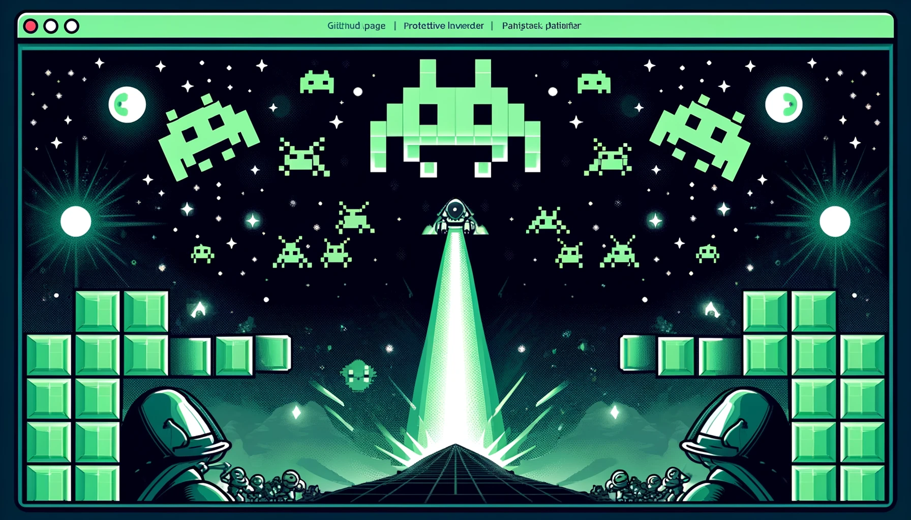

markdown_content = """
# Space Invaders com Pygame

Este guia explica o código básico para criar um jogo de Space Invaders em Python usando a biblioteca Pygame.

## Requisitos

- Python
- Pygame

Você pode instalar o Pygame via pip:

\`\`\`bash
pip install pygame
\`\`\`

## Estrutura do Jogo

O jogo é composto pelas seguintes partes:

1. **Inicialização do Pygame**
2. **Configuração da tela**
3. **Jogador e inimigos**
4. **Disparo de tiros**
5. **Sistema de pontuação**
6. **Loop principal do jogo**

### Inicialização e Configuração

O Pygame é inicializado e uma janela de 800x600 é configurada. Também definimos ícones e títulos da janela.

\`\`\`python
import pygame
import random
import math

pygame.init()
tela_largura = 800
tela_altura = 600
tela = pygame.display.set_mode((tela_largura, tela_altura))
pygame.display.set_caption("Space Invaders")
icone = pygame.image.load('icone.png')
pygame.display.set_icon(icone)
\`\`\`

### Jogador

O jogador é representado por uma imagem e pode mover-se horizontalmente na parte inferior da tela.

\`\`\`python
jogador_img = pygame.image.load('jogador.png')
jogador_x = 370
jogador_y = 480
jogador_x_change = 0
\`\`\`

### Inimigos

Os inimigos são gerados em posições aleatórias e se movem de um lado para o outro da tela, descendo cada vez que alcançam a borda.

\`\`\`python
inimigo_img = []
inimigo_x = []
inimigo_y = []
inimigo_x_change = []
inimigo_y_change = []
num_inimigos = 6

for i in range(num_inimigos):
    inimigo_img.append(pygame.image.load('inimigo.png'))
    inimigo_x.append(random.randint(0, 735))
    inimigo_y.append(random.randint(50, 150))
    inimigo_x_change.append(4)
    inimigo_y_change.append(40)
\`\`\`

### Disparo de Tiros

O jogador pode disparar tiros que se movem verticalmente para cima. Quando um tiro acerta um inimigo, o inimigo é reposicionado.

\`\`\`python
tiro_img = pygame.image.load('tiro.png')
tiro_x = 0
tiro_y = 480
tiro_x_change = 0
tiro_y_change = 10
tiro_estado = 'ready'
\`\`\`

### Pontuação

A pontuação é exibida no canto superior esquerdo da tela.

\`\`\`python
pontuacao = 0
fonte = pygame.font.Font('freesansbold.ttf', 32)

def mostrar_pontuacao(x, y):
    score = fonte.render("Pontuação : " + str(pontuacao), True, (0, 0, 0))
    tela.blit(score, (x, y))
\`\`\`

### Loop Principal

O jogo roda em um loop que verifica eventos (como teclas pressionadas), atualiza a posição dos elementos e redesenha a tela.

\`\`\`python
relogio = pygame.time.Clock()
executando = True
while executando:
    tela.fill((255, 255, 255))
    for evento in pygame.event.get():
        if evento.type == pygame.QUIT:
            executando = False
        # Processamento de teclas e tiros aqui
    pygame.display.update()
    relogio.tick(30)
\`\`\`

## Execução

Para rodar o jogo, salve este código em um arquivo \`.py\` e execute-o com Python. Certifique-se de que as imagens de ícone, jogador, inimigo e tiro estejam no mesmo diretório do script ou ajuste os caminhos conforme necessário.
"""

# Saving the markdown content to a markdown (.md) file.
path = "/mnt/data/Space_Invaders_Guide.md"
with open(path, "w") as file:
    file.write(markdown_content)

path
